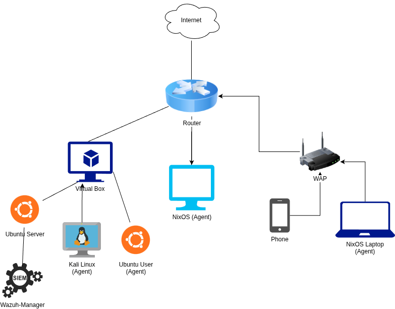
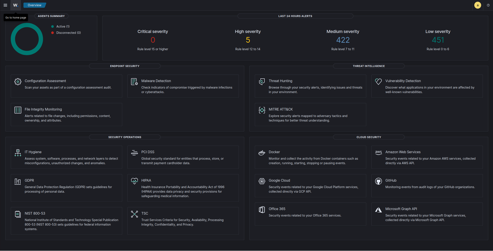
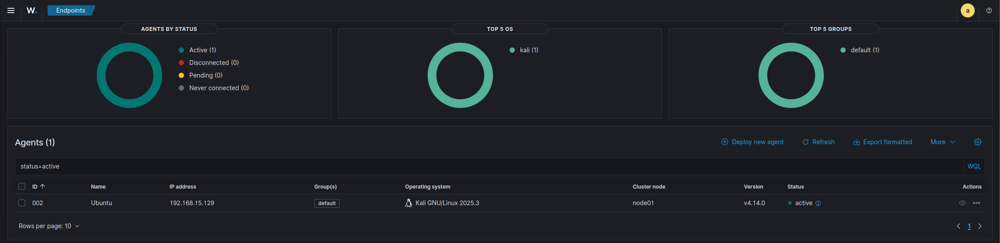
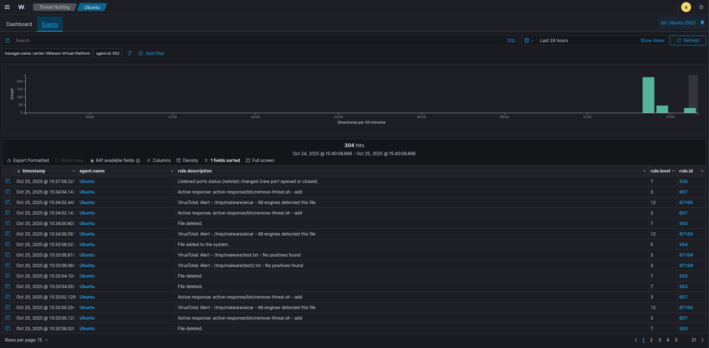
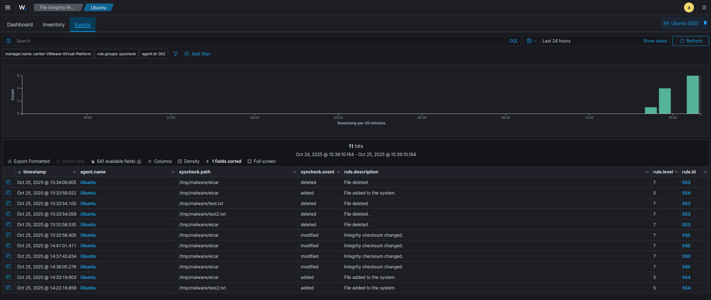

# 🛡️ Enterprise-Grade SIEM Infrastructure | Security Operations Lab

A production-simulated Security Operations Center (SOC) environment demonstrating advanced threat detection, incident response, and security monitoring capabilities using Wazuh SIEM with automated threat intelligence integration and active response mechanisms.

## 🏗️ Network Architecture



## 🎯 Security Operations Capabilities

 _Wazuh SIEM Dashboard - Real-time security monitoring and alert management_

### Core Capabilities

- **SIEM Administration & Management**: Wazuh deployment, configuration, and log aggregation
- **Threat Detection & Analysis**: Real-time security event monitoring and correlation **(TotalVirus API integrated for detection)**
- **Incident Response**: Automated response orchestration and threat remediation **(TotalVirus API with Wazuh rules**
- **Log Analysis**: Multi-source log collection and security event correlation
- **Vulnerability Management**: Integration with threat intelligence platforms
- **Security Monitoring**: 24/7 continuous monitoring simulation across multiple endpoints
- **Endpoint Detection & Response (EDR)**: Agent-based monitoring and protection

## 🔧 Infrastructure Components

### Security Information and Event Management (SIEM)

**Wazuh Manager**

- **Platform**: Ubuntu Server (Virtual Machine)
- **Role**: Central security orchestration and event correlation engine
- **Capabilities**: Log aggregation, threat detection, compliance monitoring, incident response
- **Management**: Wazuh-Manager service coordinating distributed agent fleet

### 📡 Monitored Endpoints (Agents)

 _Active agent deployment across multiple platforms with centralized management_

Multi-platform agent deployment demonstrating cross-platform security monitoring:

1.  **Kali Linux VM** (Red Team/Security Testing)

    - Offensive security tooling platform
    - Full EDR capabilities with behavioral analysis
    - Ideal for simulating adversary techniques

2.  **Ubuntu User VM** (Standard Workstation)

    - Enterprise user environment simulation
    - File integrity monitoring and anomaly detection
    - Log forwarding and security event generation

3.  **NixOS Desktop (Host Machine)** _(Deployment In Progress)_

    - Primary development workstation
    - Agent installation and enrollment in progress
    - Declarative configuration management

4.  **NixOS Laptop** _(Deployment In Progress)_

    - Secondary development workstation
    - Agent installation and enrollment in progress
    - Declarative configuration management

### 🔍 Security Monitoring & Detection

 _Real-time threat detection with VirusTotal integration and Active Response automation_

### File Integrity Monitoring (FIM)

 _File Integrity Monitoring capturing system changes and integrity violations_

Enterprise-grade file integrity monitoring deployed across all endpoints to detect unauthorized modifications, potential backdoors, and configuration tampering.

**Detection Capabilities:**

- **Real-time monitoring** of critical system files and directories
- **Change detection** for modifications, additions, and deletions
- **Baseline management** for authorized system state
- **Alert generation** with severity classification
- **Forensic analysis** of file change attributes (who, what, when, where)
- **Compliance support** for regulatory requirements (PCI-DSS, HIPAA, SOC 2)

**Use Cases:**

- Detect rootkit installations
- Identify malware persistence mechanisms
- Monitor configuration file tampering
- Track unauthorized privilege escalation attempts

### 🦠 Threat Intelligence Integration (VirusTotal)

Automated threat intelligence enrichment using VirusTotal API for enhanced malware detection and IOC validation.

**Integration Features:**

- **Automated hash lookup** for suspicious files (MD5, SHA1, SHA256)
- **Multi-engine scanning**: Leveraging 70+ antivirus engines
- **Threat intelligence enrichment** with global malware database
- **IOC correlation** with known malicious indicators
- **File reputation scoring** for risk assessment
- **Zero-day detection** capabilities through behavioral analysis

**Operational Workflow:**

1.  FIM detects file modification or creation
2.  Hash automatically submitted to VirusTotal API
3.  Results correlated with security events
4.  Alerts generated based on detection score
5.  Active response triggered for confirmed threats

### ⚡ Active Response & Automated Remediation

Automated incident response capabilities demonstrating security orchestration and automated remediation.

**Response Capabilities:**

- **Automated threat containment** upon malware detection
- **Dynamic firewall rules** for blocking malicious IPs
- **Process termination** for confirmed malicious executables
- **User account lockout** for compromised credentials
- **Network isolation** for infected endpoints
- **Custom response scripts** for organization-specific workflows

**Response Workflow:**

```
Alert Triggered → Severity Assessment → Active Response →
Containment Action → Notification → Post-Incident Analysis

```

## 🌐 Network Security Architecture

- **Perimeter Defense**: Internet-facing router with NAT and basic firewall rules
- **Wireless Security**: WPA3-secured WAP with isolated guest network capabilities
- **Network Segmentation**: Logical separation between production and testing environments
- **Endpoint Monitoring**: Agent-based EDR across all critical assets
- **Centralized Logging**: Aggregated log collection for security analytics

## 📊 Current Operational Status

### ✅ Fully Operational

- ✓ Wazuh Manager deployed and configured on Ubuntu Server
- ✓ Multi-agent architecture with Kali Linux and Ubuntu agents
- ✓ File Integrity Monitoring across all enrolled endpoints
- ✓ VirusTotal API integration with automated hash submission
- ✓ Active Response framework with automated containment
- ✓ Real-time security event correlation and alerting
- ✓ Log aggregation and centralized monitoring

### 🔄 In Progress

- ⚙️ NixOS desktop & laptop agent deployment and enrollment
- ⚙️ Custom detection rules for advanced persistent threats (APTs)
- ⚙️ Integration with additional threat intelligence feeds

**Keywords**: SIEM, SOC, Security Operations, Threat Detection, Incident Response, Log Analysis, Wazuh, EDR, Threat Intelligence, Security Monitoring, Active Response, File Integrity Monitoring, Malware Analysis, Vulnerability Management, Network Security, Linux Administration, Security Automation
